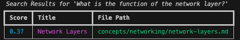

# Software Learnings Knowledge Base

This repository is my personal knowledge base for all things software. It captures what I'm learning about architecture, infrastructure, programming, security, and any other domains that support becoming a well-rounded engineer. The aim is to keep the notes structured, interconnected, and searchable as the collection grows.

## Structure

The content is organized into a few core categories:

-   `/concepts`: Foundational ideas, patterns, and architectural principles.
-   `/products`: Specific technologies, databases, and tools.
-   `/case-studies`: Analyses and case studies of large-scale system designs.
-   `/paths`: Roadmaps and study plans for certifications or broader learning goals.

For the detailed rules on structure, file naming, and content templates, please see the `[GUIDE.md](GUIDE.md)`.

## Searchable Knowledge

This is more than just a collection of markdown files. The repository includes a Python-based tool, `knowledge_base.py`, which uses a local vector database (ChromaDB) to provide semantic search capabilities.

-   **Adding Content:** When a new topic is added or updated, the `knowledge_base.py add <file_path>` command is used to parse the document and index it.
-   **Searching:** The `knowledge_base.py search "<query>"` command allows for searching the entire knowledge base using natural language, helping to find the most relevant documents for a given question.

This turns a simple set of notes into a powerful, personal search engine for software learning topics.

### Example Search

